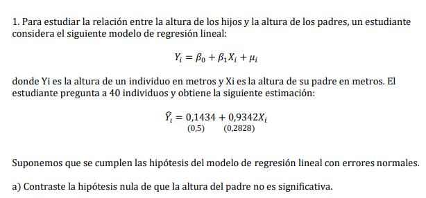
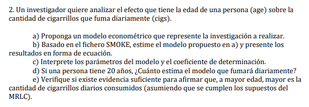
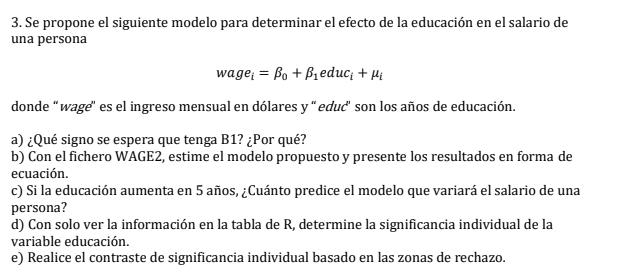

```{r setup, include=FALSE}
knitr::opts_chunk$set(echo = TRUE)
```

# Respuestas

Primero nos aseguramos de que estamos trabajando en el directorio correcto

```{r}
rm(list=ls()) ## Remueve
getwd() ## Obtiene tu directorio
setwd("C:/Users/IgnacioSepulveda/Documents/Ayudantias/econometrics")## Setealo
```

## Ejercicio 1



## Respuesta 1

Queremos testear la hipótesis si $H_0: \beta_1\neq0\:vs\:H_1: \beta_1=0$.

La formula para el estadístico t viene dada por:

$$t=\frac{\hat\beta_1-\beta_1}{SE(\beta_1)}\sim t_{\alpha/2,N-k-1}$$ Reemplazamos,

```{r}
beta_1_estimado=0.9342
beta_1_poblacional=0
SE=0.2828
### Calculamos el t estadístico
(beta_1_estimado-beta_1_poblacional)/SE
```

Ahora debemos calcular el t critico,

```{r}
alpha=0.05
N=40
K=1
abs(qt(alpha/2,N-K-1))
```

Notamos que nuestro t calculado es mayor al t critico, por lo que rechazamos nuestra hipótesis nula, por lo tanto nuestra variable es significativa. Osea que tenemos evidencia de que la altura del padre es significativa.

## Ejercicio 2

{width="559"}

## Respuesta 2

### a)

El modelo que nos permite hacer la investigación es,

$$
cigs_i=\beta_0+\beta_1agei+\mu_i
$$

Lo que estamos proponiendo en este caso es que la cantidad de cigarros consumidos por una persona es una función lineal de la edad mas un componente aleatorio, que es independiente de la edad, tiene media igual a 0 y varianza constante.

### b)

Librerías ocupadas.

```{r}
library(haven) ## Para leer dta
library(tidyverse) ## Manipular datos
```

Leemos los datos.

```{r}
df=read_dta('SMOKE.dta')
```

Ajustamos el modelo propuesto en los datos.

```{r}
reg=lm(cigs~age,data=df) 
reg %>% summary()
```

El $R^2$ es bastante bajo, una inspección al scatter plot nos mostrara el espacio donde varía la cantidad de cigarros y la edad lo que nos permitirá tener una intuición visual de cual es la relación, o bien ver si esta se acerca a una lineal.

```{r}
plot(x=df$age,
     y=df$cigs,
     ylab='Cantidad de cigarros fumandos(Y)',
     xlab='Edad(X)',
     main='Scatter plot')
abline(reg,col='red') ## Ajusta la regresion estimada
```

### c)

-   $\beta_0$: Nos dice que si una persona tiene 0 años, en promedio fumara 10 cigarros.

-   $\beta_1$: Nos dice que por cada año de edad mas, la cantidad de cigarrillos disminuye en promedio en 0.033 unidades.

-   $R^2$: Nos dice que la variabilidad en la edad explica el 0.17% de la variabilidad en la cantidad de cigarros.

### d)

Para saber cuantos cigarros fuma una persona de 20 años debemos reemplazarlo en la regresión lineal muestral, que cuenta con nuestros parámetros estimados en el punto b). Entonces partimos definiendo los parámetros y la función.

```{r}
# Creamos la función
regresion_muestral=function(x,beta_0,beta_1){
  return(beta_0+beta_1*x)
}

```

```{r}
# Parametros estimados
beta_0=10.06
beta_1=-0.033
x=20 ## Valor a predecir
regresion_muestral(x,beta_0,beta_1) ## Predecimos
```

Entonces para una edad de 20 años predecimos un promedio de 9.4 cigarrillos.

### e)

Lo que queremos hacer es testear si el coeficiente es igual mayor a cero, por lo tanto nuestras hipótesis son las siguientes $H_0: \beta_1>0\:vs\:H_1:\beta_1\le0$.

El estadístico a ocupar es el t, el cual tiene la siguiente formula.

$$t=\frac{\hat\beta_1-\beta_1}{SE(\hat\beta_1)}\sim t_{\alpha,n-k-1}$$. Es $\alpha$ dado que es test de un cola. Si hubiera sido de dos colas sería $\alpha/2$,

Ya definimos una variable que tiene guardado al $\hat\beta_1$, por lo tanto nos falta $SE(\hat\beta_1)$

```{r}
SE=0.028 ## lo sacamos de la regresión en el punto b)
t_calculado=beta_1/SE ## Sera nuestro t critico
t_calculado
```

Notas que es el mismo valor t que se encuentra en la tabla de regresión.

Ahora nos falta el $t^c=t_{0.05,807-1-1}$

```{r}
alpha=0.05 # Significancia
N=length(df$cigs) #Total datos
K=1 #Q de parametros
t_critico=qt(alpha,N-K-1) ## Quantil de la distribucion de densidad de probabilidad
t_critico
```

Como el t calculado es mayor que el t critico, no podemos rechazar $H_0$ o no podemos rechazar que el efecto es distinto de 0. Otra forma de hacerlo es calcular el p-value.

```{r}
round(pt(t_calculado,N-K-1)*100,5) ## p-value, nos dice la significancia minima desde la cual podemos rechazar la nula. 

## En caso de que hubieran sido dos colas debiese haber sido *2.
```

Comprobemos.

```{r}
nuevo_t_critico=qt(0.1194586,N-K-1) ### Debería dar lo mismo que el t-calculado.
paste('t critico nuevo:',round(nuevo_t_critico,4))
paste('t calculado:',round(t_calculado,4))
```

## Ejercicio 3



### a)

Si aumentan los años de educación, se espera que el ingreso mensual también aumente, por lo que $\beta_1$ debería ser positivo.

### b)

Leemos los datos

```{r}
rm(list=ls()) ## Removemos
df=read_dta('WAGE2.dta') ## Leemos
```

Ajustamos el modelo

```{r}
reg=lm(wage~educ,data=df) 
reg %>% summary()
```

Si armamos la ecuación tenemos que,

$$\widehat {Wage}_i=146.95+60.21\widehat {Educ}_i$$

Notemos que el $R^2$ es bastante mejor la regresión del ejercicio anterior. Lo cual lo podemos ver reflejado en el scatter plot.


```{r}
plot(
     x=df$educ,
     y=df$wage,
     ylab='Salario',
     xlab='Educacion',
     main='Scatter plot',xlim=c(0,20))
abline(a=146.95,b=60.21,col='red',xlim=c(0,20))
```

### c)

Recordemos que $\beta_1$ representa cuanto aumenta en promedio el salario cuando aumenta en un año la educación. Por lo tanto si aumenta 5 años basta multiplicar el $\beta_1$ por 5 y obtendremos el aumento total del salario. Esta es la gracia de la función lineal.

```{r}
beta_1=60.21
beta_1*5
```

Entonces un aumento de 5 años de educación aumenta el salario en promedio en 301.05 dolares.

### d)

La tabla nos muestra que el p-value es muy chico, lo que nos indica que podemos rechazar la hipótesis nula, por lo tanto educación es significativa explicando el salario.

### e)

Queremos testear la siguiente hipótesis $H_0:\beta_1\neq0\:vs\:H_1:\beta_1=0$.

$$t=\frac{\hat\beta_1-\beta_1}{SE(\beta_1)}\sim t_{\alpha/2,N-k-1}$$.

Reemplazamos y obtenemos.

```{r}
SE=5.695
t_calculado=beta_1/SE
t_calculado
```

El estadístico t es grande por lo que es evidente que rechazaremos. **Dado que es de dos colas!**

```{r}
alpha=0.05 # Significancia
N=length(df$wage) #Total datos
K=1 #Q de parametros
t_critico=qt(alpha/2,N-K-1) ## Quantil de la distribucion de densidad de probabilidad
abs(t_critico)
```

Queda mas claro cuando vemos el t-critico.
