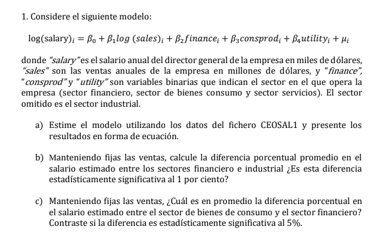
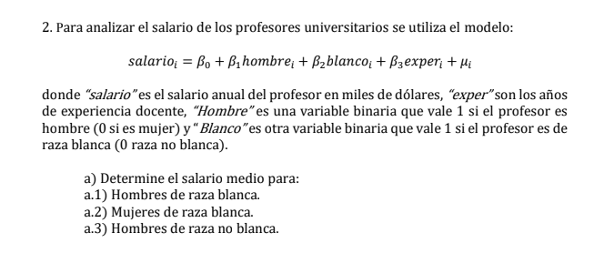
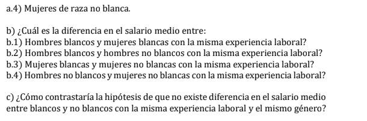
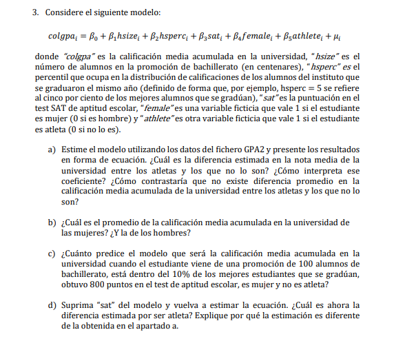

```{r setup, include=FALSE}
knitr::opts_chunk$set(echo = TRUE)
```

# Respuestas



**Paso 0.1:** Remuevo todo el entorno y configuro mi environment.

```{r}
rm(list=ls())
getwd() ## Directorio inicial
setwd("C:/Users/IgnacioSepulveda/Documents/Ayudantias/econometrics") ## Directorio nuevo
getwd() ## Check
```

\newpage

**Paso 0.2:** Carga las librerías necesarias, **si no las tengo las instalo**

```{r,warning=FALSE,message=FALSE}
## install.package("tidyverse") si no lo tengo instalado, saco #, y lo corro
## install.packages("stargazer")
## install.packages("haven")
library("tidyverse")
library("haven")
library("stargazer")

```

## 1

### a)

**Paso 1:** Cargo la base,

```{r}
df=read_dta('CEOSAL1.dta')
```

**Paso 2:** Veo que tal los datos,

```{r}
#str(df)
```

**Paso 2:** Corro la regresión y obtengo los coeficientes,

```{r}
reg_1a=lm(lsalary~lsales+finance+consprod+utility,data=df)
```

**Paso 3:** Finalmente armo la ecuación,

$$log(salary)_i=4.9+0.244log(sales)_i+0.124finance_i+0.239consprod_i-0.352utility_i$$

### b)

Aquí debemos notar del enunciado que tanto finance ,consprod y utility son tipos de industrias, por lo tanto son variables dummy donde su coeficiente es una difencia de medias con respecto al industrial. Entonces basta con observar el p-value de la tabla.

Queremos hacer el siguiente test,

$H_0:\beta_2=0\:\text{vs}\:H_1:\beta_2\ne0$

Rechazamos $H_0$ cuando $\text{p-value}<\alpha$

\newpage

```{r}
reg_1a %>% summary()
```

Como $\text{p-value}=0.166$ no podemos rechazar la nula de que la medias son estadisticamente iguales.

### c)

El $\beta$ que nos da la diferencia es simplemente la resta del $\beta$ asociado a consprod menos el asociado a finance, dado que se cancela la media del industrial dado que ambos lo usan como base, por lo tanto sabemos que el $\beta$,o diferecias de medias, sera igual a 0.114 . El problema es que el error estandar no podemos calcularlo tan facil. La formula seria la siguiente $se(\beta_1-\beta_2)=\sqrt{Var(\beta_1-\beta_2)}=\sqrt{Var(\beta_1)-Var(\beta_2)+2Cov(\beta_1,\beta_2)}$

Una forma más fácil es simplemente cambiar la base de la regresión y dado que queremos comparar consumo vs finance podríamos dejar a finance como base.

\newpage

El modelo cambiaría al siguiente,

$$log(salary)_i=\beta_0+\beta_1log(sales)_i+\beta_2indus_i+\beta_3consprod_i+\beta_4utility_i$$

```{r}
reg_1c=lm(lsalary~lsales+indus+consprod+utility,data=df)
reg_1c %>% summary()
```

Vemos que efectivamente el valor de 0.1144, pero su se es de 0.0914. Con un $\text{p-value}=2.12$ no podemos rechazar al 5% entonces no es significativa.

## 2

{width="511"}

{width="402"}

Desarrollo en la pizarra.

## 3



**Paso 1:** Veo que tal los datos y remuevo anteriores,

```{r}
rm(list=ls()) ## Removemos todo lo anterior
df=read_dta('gpa2.dta')
```

**Paso 2:** Veo que tal los datos,

```{r}
#str(df)
```

### a)

```{r}
reg_3a=lm(colgpa~hsize+hsperc+sat+female+athlete,data=df)
reg_3a
```

$colga_i=1.194+0.024hsize_i-0.013hsperc_i+0.002sat_i+0.156female_i +0.17athlete_i$

Con el $\beta$ asociado a atleta podemos saber la diferencia, el cual muestra que los atletas en promedio ganan 0.17 mas que los no atleta, cuando todo lo demás se mantiene constante.

\newpage

Para saber si es significativa vemos su p-value.

```{r}
reg_3a %>% summary()
```

El p-value es bien chico por lo tanto podemos rechazar incluso al 1%, lo que implica de que atleta es significativa y existe una diferencia estadística entre las medias de sus salarios.

### b)

Para las mujeres es $\beta_0+\beta_{female}=1.194+0.156=1.35$

Para los hombre es $\beta_0=1.194$

### c)

```{r}
### Creamos el nuevo df
nueva_data=data.frame(hsize=1,hsperc=10,sat=800,female=1,athlete=0)
paste("predecimos....")
reg_3a %>% predict(newdata=nueva_data)
```

### d)

Recordamos que la formula es la siguiente $\text{sesgo}=\beta_{sat} \frac{Cov(athlete,sat)}{Var(athlete)}$.

Entonces como esperamos que sea $\beta_{sat}$? Mejores notas debiesen implicar un salario...

Y la $Cov(athlete,sat)$? Qué pasa si calculamos su correlación?

```{r}
cor(df$sat,df$athlete)
```

Vemos que su relación lineal es negativa, por lo tanto nuestro sesgo debiese ser negativo como el $\beta_{sat}$ es positivo, lo que implicaría una subestimación. Osea el coeficiente que nuevo sera menor que el anterior.

Comprobemos....

```{r, results = "asis"}
reg_3d=lm(colgpa~hsize+hsperc+female+athlete,data=df)
stargazer(reg_3a,reg_3d,type='latex',header=FALSE)
```
